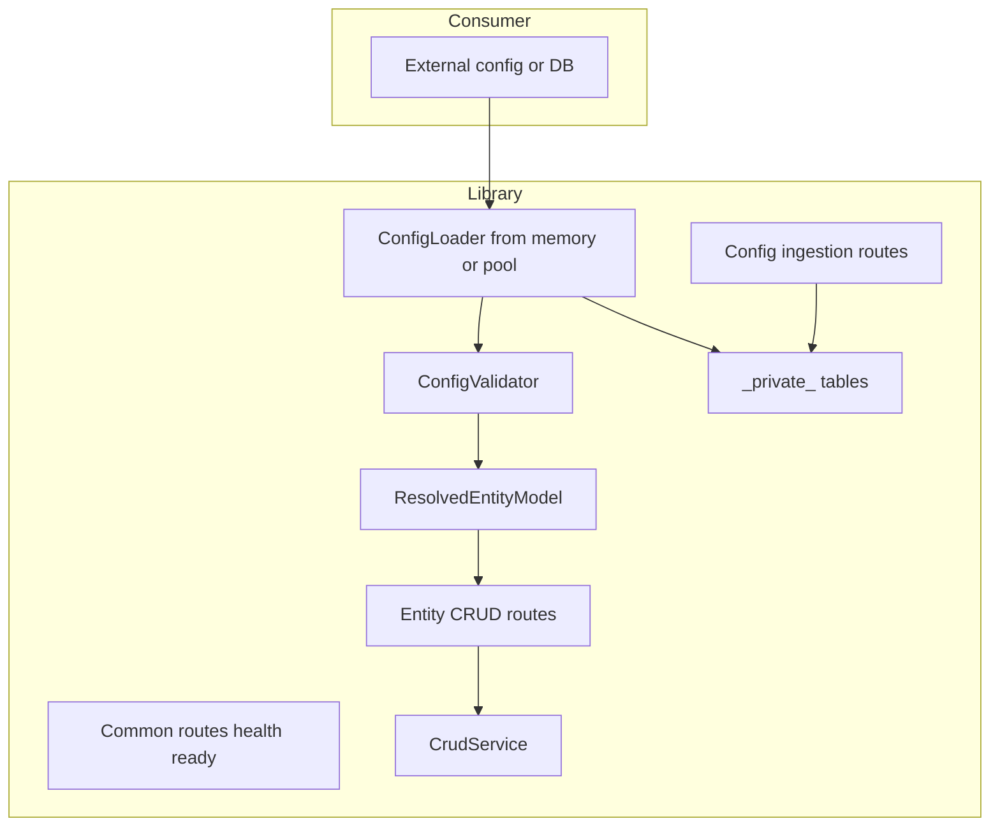

# Configuration-Driven Rust Backend Framework — Combined Design

## Context

The repo defines a **Postgres config schema** in [docs/postgres-config-schema.md](docs/postgres-config-schema.md) and sample configs under [sample/](sample/). This design: **(1)** implements a **reusable library** consumable by other projects; **(2)** accepts config from **external sources** (including DB); **(3)** exposes **entity CRUD** and **config ingestion** APIs; **(4)** stores ingested config in `**_private_***` tables; **(5)** provides **common endpoints** (health, readiness). No Rust code exists yet; design is greenfield.

---

## 1. Rust technology stack

| Layer               | Choice                             | Rationale                                             |
| ------------------- | ---------------------------------- | ----------------------------------------------------- |
| **Runtime**         | Tokio                              | De facto async runtime; ecosystem alignment.          |
| **Web**             | Axum                               | Ergonomic, no macro magic; fits “no hidden behavior”. |
| **HTTP**            | Tower (via Axum)                   | Middleware (logging, auth later), composable.         |
| **DB driver**       | sqlx (runtime-tokio)               | Raw SQL, parameterized queries; no ORM.               |
| **Connection pool** | sqlx::PgPool                       | Connection pooling; configurable.                     |
| **Serialization**   | serde + serde_json                 | JSON in/out; standard.                                |
| **Config loading**  | Caller-supplied or from *private** | No bundled config; load from consumer or DB.          |
| **Validation**      | validator or custom from config    | Rules in config (required, format, allowed, etc.).    |
| **Error handling**  | thiserror                          | Typed errors; map to HTTP and envelope.               |
| **Logging**         | tracing + tracing-subscriber       | Structured logging.                                   |

**Trade-offs**: sqlx over diesel for dynamic SQL; Axum over Actix for minimalism and Tower.

---

## 2. JSON configuration schema for entities

- **Reuse** existing six config types (schemas, enums, tables, columns, indexes, relationships) as in [postgres-config-schema.md](docs/postgres-config-schema.md).
- **Option A (recommended)**: Separate **api_entities** config: `entity_id`, `path_segment`, `operations`, `validation` (per-column rules: required, format, allowed, min/max_length, pattern, etc.). Keeps DDL and API concerns separate.
- **Validation rules** in API config: required, type, format (email, uuid, date-time), min/max_length, pattern, allowed (enum), minimum/maximum for numbers. Store under e.g. `validation.columns` keyed by column name.
- **JSONB** columns: API accepts JSON; pass through as parameterized value unless JSONB-specific validation added later.

---

## 3. API endpoint conventions

**Base URL**: e.g. `/api/v1`

**Entity CRUD** (per entity, from config):

| Operation   | Method    | Path                    | Body            | Response      |
| ----------- | --------- | ----------------------- | --------------- | ------------- |
| Create      | POST      | `/{entity_plural}`      | JSON object     | 201 + created |
| Read        | GET       | `/{entity_plural}/{id}` | —               | 200 or 404    |
| Update      | PATCH/PUT | `/{entity_plural}/{id}` | JSON object     | 200 or 404    |
| Delete      | DELETE    | `/{entity_plural}/{id}` | —               | 204           |
| Bulk Create | POST      | `/{entity_plural}/bulk` | JSON array      | 201 + array   |
| Bulk Update | PATCH/PUT | `/{entity_plural}/bulk` | `[{ id, ... }]` | 200 + array   |

**Envelope**: Success `{ "data": ..., "meta": {} }`; Error `{ "error": { "code", "message", "details" } }`. IDs in path/body; type (uuid, bigint) from column config.

---

## 4. Common endpoints

Library provides **common routes** (e.g. `common_routes()`) that consumers mount:

| Endpoint                      | Method | Path (example)              | Purpose                                                                 |
| ----------------------------- | ------ | --------------------------- | ----------------------------------------------------------------------- |
| **Health (liveness)**         | GET    | `/health`                   | Process up; returns 200 + `{ "status": "ok" }`.                         |
| **Readiness**                 | GET    | `/ready` or `/health/ready` | Can accept traffic; optional DB check (`SELECT 1`). 200 ready, 503 not. |
| **Version / info** (optional) | GET    | `/version` or `/info`       | Service name/version from env or build.                                 |

Readiness can take an optional `PgPool`; response JSON for orchestration (e.g. Kubernetes). No entity config required.

---

## 5. Config ingestion API

**Purpose**: Allow external systems to **feed** DB configuration via REST and persist it so the engine can load config from the database.

**Base path**: e.g. `/api/v1/config`

| Config type   | POST (replace all)           | GET (list all)              |
| ------------- | ---------------------------- | --------------------------- |
| Schemas       | `POST /config/schemas`       | `GET /config/schemas`       |
| Enums         | `POST /config/enums`         | `GET /config/enums`         |
| Tables        | `POST /config/tables`        | `GET /config/tables`        |
| Columns       | `POST /config/columns`       | `GET /config/columns`       |
| Indexes       | `POST /config/indexes`       | `GET /config/indexes`       |
| Relationships | `POST /config/relationships` | `GET /config/relationships` |
| API entities  | `POST /config/api_entities`  | `GET /config/api_entities`  |

**POST** body: JSON array of records (same shape as [sample/](sample/)). Server **replaces** stored set for that type (or upserts by `id`); **validate** before persisting; on failure return 422 and do not replace. **GET**: return current stored config (array). Same response envelope as rest of API. **Authorization**: Config endpoints are privileged; design for auth (middleware, API key, or network isolation).

---

## 6. Storage in *private** tables

- **Naming**: Store config in **separate tables** with a reserved prefix, e.g. `**_private_**`, so they are isolated from application data: `_private_schemas`, `_private_enums`, `_private_tables`, `_private_columns`, `_private_indexes`, `_private_relationships`, `_private_api_entities`.
- **Layout** (one table per config type): `id` (PK, from config record id), `payload` (JSONB, full record), `updated_at` (timestamptz). One row per config record.
- **Creation**: Library (or one-time migration) **creates these tables** if missing; DDL is fixed and versioned in the library. Application entities (e.g. `users`, `orders`) are defined *by* this config; engine never exposes `_private_*` as data API.
- **Loading**: Engine can **load config from *private**** (e.g. `load_from_pool(pool)`) in dependency order, validate, and build resolved model. Config can thus come from **external source** (files, in-memory) **or** from DB.

---

## 7. Reusable library and crate layout

- **Single library crate** (e.g. `architect-sdk`): other projects depend on it (like an npm package). No config bundled.
- **Library exposes**: Config loading from **caller-supplied** data (in-memory structs or paths) or from **DB** via `load_from_pool`; validation and **ResolvedEntityModel**; **CrudService**, safe SQL builder, request validator; **Router builder** for entity routes and **common_routes()** for health/ready/version; **config ingestion routes** that read/write *private** tables.
- **Consumer**: Supplies config (or uses config from *private**), supplies `PgPool`, composes router (common + config + entity routes), runs server. Optional example binary in repo that consumes the lib.
- **Config from external source**: Library accepts in-memory config or paths; does not assume fixed paths. Optional `ConfigSource` trait later for async/source-agnostic loading.

---

## 8. Runtime architecture

- **Config layer**: Load from caller or *private**; validate; produce resolved model. Fail fast at startup if invalid.
- **Routes**: Common (health, ready), config (POST/GET per type), entity CRUD (from model). All from library.
- **Handlers**: Extract path/body; parse id; validate request; call CrudService or config store; return envelope.
- **SQL**: Safe SQL builder uses only config-derived identifiers; values as bound parameters. Same for *private** writes.

---

## 9. Dynamic SQL built safely

- **Principle**: User/request data never concatenated into SQL. **Identifiers** (schema, table, column names) from **validated config** only; **values** always bound parameters (`$1`, `$2`, …).
- **Allowlist**: Resolved model holds known identifiers. INSERT/SELECT/UPDATE/DELETE built from that; UPDATE only includes body keys that exist in config.
- **Bulk**: Transaction; multi-row INSERT or per-row UPDATE; same safety rules. Use `RETURNING` with column list from config.

---

## 10. Examples (entity config and routes)

- **api_entities** example: [sample/api_entities.json](sample/api_entities.json) (entity_id, path_segment, operations, validation per column). Entity routes e.g. `POST/GET/PATCH/DELETE /api/v1/users`, `/api/v1/users/bulk`, same for orders.
- **SQL**: Parameterized only; e.g. `SELECT ... FROM public.users WHERE id = $1`, `INSERT INTO public.users (...) VALUES ($1,$2,$3) RETURNING ...`.

---

## 11. Security

- **SQL injection**: Config-derived identifiers only; values bound. Same for *private**.
- **Validation**: Config and request validation before persist or DB call; 422 for invalid.
- **Input/bulk size**: Limit body size and bulk count (e.g. 100).
- **Config endpoints**: Privileged; enforce auth. **Sensitive columns**: Optional config to exclude from API.
- **HTTPS/CORS**: Delegate to reverse proxy; CORS configurable.

---

## 12. Evolution toward code generation

- **Phase 1**: Config at startup (from memory, files, or *private**); generic handlers; safe dynamic SQL.
- **Phase 2**: Optional codegen from same config (Rust structs, typed repos, validation).
- **Phase 3**: Gradually use generated types in handlers; same code path.

---

## Summary (combined)

- **Stack**: Tokio, Axum, sqlx, serde, thiserror, tracing; config from external source or *private**.
- **Library**: Reusable crate; no bundled config; exposes loader (memory/pool), validator, resolved model, common_routes(), config ingestion routes, entity_routes(), CrudService, safe SQL.
- **Config**: Postgres config schema + api_entities; can be supplied in-memory, by path, or via **config API** into `**_private_***` tables; engine loads and validates from any source.
- **APIs**: Common (health, readiness, optional version); config (POST/GET per type to feed and read config); entity CRUD (six ops per entity); all with standard envelope.
- **Safety**: Parameterized SQL only; validation and bulk limits; config endpoints protected; evolution path to codegen.

