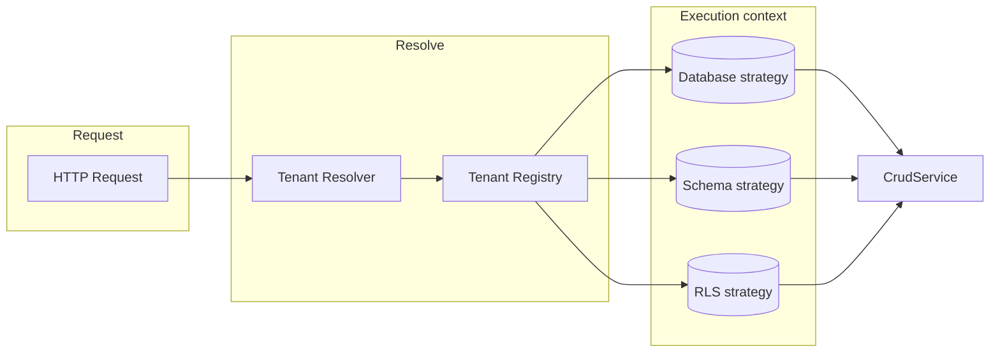

# Multi-tenant implementation (all three modes coexisting)

## Goal

Support three strategies per tenant at the same time:

- **Database:** tenant has its own PostgreSQL database (own pool).
- **Schema:** tenant shares DB but has its own schema (same pool, schema override).
- **RLS:** tenant shares DB and schema; isolation via Row Level Security and `app.tenant_id` session variable.

REST endpoints stay the same (paths and payloads); tenant is supplied by header (e.g. `X-Tenant-ID`) or optional path prefix. No change to response shapes.

---

## Architecture overview

- **Tenant registry:** maps `tenant_id` → strategy + strategy-specific config; stored in a **central database** and loaded into memory for fast lookup.
- **Execution context:** for each request we produce (pool or connection, optional schema override, optional RLS tenant_id). CRUD and SQL layers only see this context, not the strategy name.

---

## 1. Tenant registry: central database and types

**Storage:** The tenant registry is stored in a **central database** (the same DB as the default `DATABASE_URL`, i.e. where `architect._sys_*` tables live). This DB is the single source of truth for which tenants exist and which strategy each uses.

**New table:** `architect._sys_tenants` (in the same schema as other *sys** tables, from `ARCHITECT_SCHEMA`).

- **Columns:**
  - `id` TEXT PRIMARY KEY (tenant_id).
  - `strategy` TEXT NOT NULL — one of `database`, `schema`, `rls`.
  - `database_url` TEXT NULL — required when strategy = `database`; connection string for that tenant’s DB.
  - `schema_name` TEXT NULL — required when strategy = `schema`; schema name for app tables in the shared DB.
  - Optional: `updated_at` TIMESTAMPTZ, `comment` TEXT.
- **DDL:** Add creation of `_sys_tenants` in [src/store.rs](src/store.rs) alongside `ensure_sys_tables` (e.g. after `_sys_packages`), so the central DB always has this table when the app boots.

**New module:** [src/tenant.rs](src/tenant.rs) (or `src/multi_tenant.rs`).

- **Strategy enum:** `TenantStrategy::Database | Schema | Rls`.
- **Per-tenant entry:** `TenantEntry { strategy, database_url: Option<String>, schema_name: Option<String> }` — matches the table columns.
- **TenantRegistry** (trait or in-memory struct used at runtime):
  - `fn get(&self, tenant_id: &str) -> Option<TenantEntry>`.
  - **Implementation:** Backed by an in-memory cache (e.g. `HashMap<String, TenantEntry>`) that is **loaded from the central DB** at startup and optionally refreshed (see below). No env or file as primary source.
- **Loading from DB:** On startup, after the default pool is created and `ensure_sys_tables` has run:
  - Query: `SELECT id, strategy, database_url, schema_name FROM architect._sys_tenants` (using `qualified_sys_table("_sys_tenants")`).
  - Build the in-memory registry from the rows. If the table is empty, the registry is empty (no tenants).
- **Refresh (optional):** Support reloading the registry from the central DB so that adding/updating tenants (via admin API or direct DB write) can be picked up without restart. Options: (a) reload on a timer, (b) reload via an admin endpoint (e.g. `POST /api/v1/admin/tenants/reload`), or (c) lazy refresh on cache miss (re-query DB and update cache). Plan recommends (a) or (b) to keep request path simple.
- **Validation:** When loading a row, require: for `database`, `database_url` is non-null; for `schema`, `schema_name` is non-null; for `rls`, no extra columns required. Invalid rows can be skipped or cause startup to fail (configurable).

**Config:** The central DB is the one at `DATABASE_URL`. Document that for `database` strategy, `database_url` is required; for `schema`, `schema_name` is required; for `rls`, only `tenant_id` (and strategy) is needed.

---

## 2. Tenant resolution (extractor)

**New:** [src/extractors/tenant.rs](src/extractors/tenant.rs) or inside [src/handlers/entity.rs](src/handlers/entity.rs).

- **Resolve tenant_id from request:**
  - **Primary:** header `X-Tenant-ID` (or configurable name).
  - **Optional:** path prefix `/api/v1/t/:tenant_id/...` (if you add nested routes later).
- **Axum extractor:** e.g. `TenantId(Option<String>)` or `TenantId(String)` if tenant is required for entity routes. If tenant is optional, non-tenant requests use a “default” context (current behavior: single pool, no override, no RLS).
- **Output:** `tenant_id: Option<String>`. If tenant is required and missing → 400/401. If tenant is present, look up in registry; if unknown → 404.

Do **not** change existing route paths for the default (no-tenant) case: keep `/:path_segment` and `/package/:package_id/:path_segment`. When `X-Tenant-ID` is present, use it; when absent, treat as non-tenant and use default pool + config schema.

---

## 3. AppState and pool management

**File:** [src/state.rs](src/state.rs).

- **Current:** `pool: PgPool`, `model`, `package_models`.
- **Add:**
  - **Default pool:** keep as the main pool (from `DATABASE_URL`). Used for: non-tenant requests, `schema` and `rls` tenants (shared DB), and config/*sys** reads when config lives in the shared DB.
  - **Tenant pools (database strategy):** `tenant_pools: Arc<RwLock<HashMap<String, PgPool>>>` keyed by `tenant_id`. On first request for a `database` tenant, resolve `database_url` from registry, call existing `ensure_database_exists` (if desired), create pool, insert into map. Use a max-pools limit or TTL if needed.
  - **Tenant registry:** `tenant_registry: Arc<TenantRegistry>` (or `Arc<dyn TenantRegistry>`) so handlers can resolve tenant → strategy + config.
- **Config/model loading:** For `database` tenants, config and `_sys_*` live in that tenant’s DB, so `get_or_load_package_model` must load from the tenant’s pool and cache per `(package_id, tenant_id)` when strategy is database. For `schema` and `rls`, config stays on the default pool; cache can remain per `package_id` (same config, different schema or RLS at query time).

---

## 4. Execution context (per request)

**Type (e.g. in [src/tenant.rs](src/tenant.rs)):** `TenantContext` or `ExecutionContext`:

- **Pool to use:** either the default pool (for schema/rls) or the tenant’s pool (for database).
- **Schema override:** `Option<String>`. Only set for `schema` strategy; when set, SQL layer uses this instead of `entity.schema_name` for app tables. Config/*sys** schema (e.g. `architect`) is unchanged.
- **RLS:** `Option<String>` (tenant_id). When set, all queries for this request must run on a **single** connection that has executed `SET LOCAL app.tenant_id = '...'` once. So we need to pass either `&PgPool` or `&mut PgConnection` into the execution layer.

**Building context in handlers:** After extracting tenant_id and looking up registry:

- **Database:** context = (tenant_pool, schema_override: None, rls: None). Use config schema from package (each DB has its own *sys** and app schema).
- **Schema:** context = (default_pool, schema_override: Some(tenant.schema_name), rls: None).
- **Rls:** context = (default_pool, schema_override: None, rls: Some(tenant_id)). Before any CRUD, acquire one connection from the pool, run `SET LOCAL app.tenant_id = $1`, then use that connection for all CRUD in this request.

---

## 5. SQL layer: schema override

**File:** [src/sql/builder.rs](src/sql/builder.rs).

- **Current:** Every builder uses `qualified_table(&entity.schema_name, &entity.table_name)` (e.g. [lines 67–70, 84–86, 169, 214–216, 255, 293, 335](src/sql/builder.rs)).
- **Change:** Add an optional parameter `schema_override: Option<&str>` to all public builder functions. When `Some(s)`, use `s` for the schema; otherwise use `entity.schema_name`. So effectively: `let schema = schema_override.unwrap_or(&entity.schema_name); qualified_table(schema, &entity.table_name)`.
- **Functions to update:** `select_by_id`, `select_list`, `select_list_with_includes`, `select_by_column_in`, `insert`, `update`, `delete`. Each takes `schema_override: Option<&str>` and passes it through to any internal `qualified_table` / table reference. For `select_list_with_includes`, the main entity and each related entity need their schema: for “schema” strategy, override applies to all app tables (same tenant schema), so use the same override for main and related.

Result: same SQL shape; only the schema name changes when override is present.

---

## 6. CRUD execution: executor + schema override + RLS

**File:** [src/service/crud.rs](src/service/crud.rs).

- **Current:** All methods take `pool: &PgPool` and call `sqlx::query(...).fetch_optional(pool)` etc.
- **Change:**
  - **Executor abstraction:** Use `sqlx::Executor` so call sites can pass either `&PgPool` or `&mut PgConnection`. Define an enum, e.g. `RequestExecutor<'a>`, with variants `Pool(&'a PgPool)` and `Conn(&'a mut PgConnection)`, and implement `sqlx::Executor` for it (delegate to the inner pool or connection). Then CrudService methods take `executor: impl sqlx::Executor<Database = sqlx::Postgres>` (or a generic `E`) plus `schema_override: Option<&str>`.
  - **Schema override:** Pass `schema_override` into every builder call (select_list, select_by_id, insert, update, delete, select_by_column_in, select_list_with_includes). So CrudService gains a `schema_override` parameter on every method and forwards it to the SQL builder.
  - **RLS path:** For RLS, handlers must use a single connection. So in the handler (or a small helper), do: `let mut conn = pool.acquire().await?; sqlx::query("SET LOCAL app.tenant_id = $1").bind(tenant_id).execute(&mut *conn).await?;` then pass `&mut *conn` as the executor and `schema_override: None` to all CrudService calls for that request. So the “execution context” for RLS is (connection with SET done, no schema override). No change inside CrudService for RLS beyond using the provided executor.

**Concrete signature change (conceptually):**

- `list(executor, entity, schema_override, filters, limit, offset)` → builds `select_list(entity, filters, ..., schema_override)`, runs via executor.
- Same for `list_with_includes`, `read`, `create`, `update`, `delete`, `bulk_create`, `bulk_update`, `fetch_where_column_in`.

Handlers will pass: executor (pool or conn), schema_override from context.

---

## 7. Entity handlers: resolve tenant and call CRUD with context

**File:** [src/handlers/entity.rs](src/handlers/entity.rs).

- **Flow per handler (list, create, read, update, delete, bulk_create, bulk_update), for both default and package-scoped:**
  1. Extract tenant (e.g. `X-Tenant-ID` via extractor). If no tenant, use default context (current pool, no override, no RLS).
  2. If tenant present, look up in registry; if not found return 404.
  3. Build execution context:
    - **Database:** get or create pool for tenant, context = (pool, None, None). Load package model from tenant pool when strategy is database (and cache per (package_id, tenant_id)).
    - **Schema:** context = (state.default_pool, Some(tenant.schema_name), None). Load package model from default pool (existing behavior).
    - **Rls:** context = (default_pool, None, Some(tenant_id)). Acquire connection, `SET LOCAL app.tenant_id`, then pass that connection as executor for all CRUD in this handler.
  4. Resolve entity (from state.model or get_or_load_package_model with the correct pool for model loading).
  5. Call CrudService with executor + schema_override from context. For RLS, use the same connection for `attach_includes` and any other CrudService calls in that handler.
- **Helper:** To avoid duplicating “acquire conn, SET, run closure with executor” in every handler, add a helper, e.g. `with_tenant_executor(state, tenant_id, |executor, schema_override| async move { ... })`. The helper (a) resolves tenant from registry, (b) for RLS acquires connection and sets variable, (c) calls the closure with the right executor and schema_override, (d) for RLS drops the connection after the future completes. Handlers then look like: get entity, then `with_tenant_executor(..., |exec, schema_override| async move { CrudService::list(exec, &entity, schema_override, ...).await })`.
- **attach_includes:** Today it takes `pool: &PgPool` and calls `CrudService::fetch_where_column_in(pool, ...)`. Change to take the same executor + schema_override as the main handler so that include queries run in the same tenant context (same pool/connection and same schema/RLS).

Result: REST paths and request/response bodies unchanged; only internal resolution and execution context change.

---

## 8. Config and package model loading

**File:** [src/handlers/entity.rs](src/handlers/entity.rs) (`get_or_load_package_model`).

- **Current:** `get_or_load_package_model(state, package_id)` always uses `state.pool` and caches by `package_id`.
- **Change:** Add an optional `tenant_context: Option<&TenantContext>`. When context is present and strategy is **Database**, load config from the tenant’s pool and cache by `(package_id, tenant_id)` so that each database tenant can have its own config and model. When strategy is **Schema** or **Rls**, keep loading from the default pool and cache by `package_id` (config is shared; only execution context differs).

**Config routes and package install:** [src/handlers/config.rs](src/handlers/config.rs), [src/handlers/package.rs](src/handlers/package.rs).

- Keep config POST/GET and package install on the **default** pool and default schema for now (no tenant in config routes). So *sys** and package install remain global. If later you want tenant-scoped config for database tenants, you can add a tenant parameter to config/package routes and choose the pool from context there too.

---

## 9. Migrations (apply_migrations)

**File:** [src/migration.rs](src/migration.rs).

- **Current:** `apply_migrations(pool, config)` uses schema from config (e.g. `schema.name`) for CREATE TABLE/INDEX etc.
- **Change:** Add an optional `schema_override: Option<&str>`. When present, use it instead of `schema.name` for all DDL that creates tables/indexes in the “app” schemas (not the architect schema). So:
  - **Database strategy:** When provisioning a new tenant DB, run `ensure_sys_tables(tenant_pool)`, then `apply_migrations(tenant_pool, config, None)` (use config schema as today).
  - **Schema strategy:** For each tenant with strategy schema, run `apply_migrations(default_pool, config, Some(tenant.schema_name))` so tables are created in that tenant’s schema. You can do this in a “provision tenant” flow or when the first request for that tenant is served (lazy schema creation) if desired.
  - **RLS strategy:** Run once: `apply_migrations(default_pool, config, None)`. Ensure config includes a `tenant_id` column on tenant-scoped tables and that migrations enable RLS and add policies using `current_setting('app.tenant_id', true)`. That may require a small extension in [src/config/types.rs](src/config/types.rs) (e.g. table-level `rls_tenant_column: Option<String>`) so migration can generate the right policies; otherwise document that RLS and tenant_id are added manually or via a separate migration step.

---

## 10. RLS: session variable and policies

- **Session variable:** Use `app.tenant_id`. At the start of each request that uses RLS, run on the request’s connection: `SET LOCAL app.tenant_id = 'tenant_foo'` (parameterized). Then all SELECT/INSERT/UPDATE/DELETE in that request are subject to RLS.
- **Policies:** Tables that are tenant-scoped must have RLS enabled and policies like:
  - `USING (tenant_id = current_setting('app.tenant_id', true)::text)`
  - `WITH CHECK (tenant_id = current_setting('app.tenant_id', true)::text)` for INSERT/UPDATE.
- **tenant_id column:** Either require it in the package column config for RLS mode, or have migration add it and the policies when a table is marked as tenant-scoped (e.g. via a table-level config or convention). Plan assumes package defines `tenant_id` and migration (or a follow-up step) enables RLS and adds policies.

---

## 11. Route and REST surface

- **No path changes for existing endpoints:** Keep `GET/POST /api/v1/:path_segment`, `GET/PATCH/DELETE /api/v1/:path_segment/:id`, bulk routes, and all `/api/v1/package/:package_id/...` routes as they are.
- **Tenant:** Required or optional via header `X-Tenant-ID`. If required, missing or unknown tenant → 4xx. If optional, missing tenant → use default pool and no override (current behavior).
- Optional later: add prefixed routes like `/api/v1/t/:tenant_id/:path_segment` that set tenant from path and delegate to the same handler logic.

---

## 12. Example server and bootstrap

**File:** [examples/server.rs](examples/server.rs).

- Create default pool from `DATABASE_URL` (central DB). Run `ensure_sys_tables` so `architect._sys_tenants` exists.
- **Load tenant registry from central DB:** Query `architect._sys_tenants`, build in-memory `TenantRegistry`, then construct AppState with default pool, empty `tenant_pools`, and this registry.
- Seed data: if the table is empty, the app runs with no tenants (all requests without a tenant use default context). To add tenants, insert into `_sys_tenants` (via migration script, admin API, or direct SQL) and either restart or call the registry refresh endpoint if implemented.
- No change to route registration; handlers use the new extractor and context.

---

## 13. File and dependency summary

| Area                      | Files to add or touch                                                                                                                                                                                     |
| ------------------------- | --------------------------------------------------------------------------------------------------------------------------------------------------------------------------------------------------------- |
| Tenant types and registry | New [src/tenant.rs](src/tenant.rs): strategy enum, TenantEntry, TenantRegistry (in-memory cache), and `load_registry_from_pool(pool)` that reads from `architect._sys_tenants`.                           |
| Store (central DB table)  | [src/store.rs](src/store.rs): in `ensure_sys_tables`, add DDL for `architect._sys_tenants` (id, strategy, database_url, schema_name, optional updated_at).                                                |
| Extractor                 | New [src/extractors/tenant.rs](src/extractors/tenant.rs) or in handlers.                                                                                                                                  |
| State                     | [src/state.rs](src/state.rs) (default pool, tenant_pools, registry).                                                                                                                                      |
| SQL                       | [src/sql/builder.rs](src/sql/builder.rs) (schema_override in all builders).                                                                                                                               |
| CRUD                      | [src/service/crud.rs](src/service/crud.rs) (executor + schema_override).                                                                                                                                  |
| Handlers                  | [src/handlers/entity.rs](src/handlers/entity.rs) (resolve tenant, build context, use executor + override; attach_includes uses same context; get_or_load_package_model per tenant for database strategy). |
| Migrations                | [src/migration.rs](src/migration.rs) (optional schema_override; RLS policy generation if table-level flag added).                                                                                         |
| Config types              | [src/config/types.rs](src/config/types.rs) (optional: `rls_tenant_column` or similar for migration).                                                                                                      |
| Example                   | [examples/server.rs](examples/server.rs): ensure_sys_tables, then load tenant registry from central DB, init AppState with default pool, tenant_pools, and registry.                                      |

No new external dependencies; registry uses existing sqlx and the same central DB as `_sys_*`.

---

## 14. Testing and rollout

- **Unit:** Tenant registry resolution for each strategy; SQL builder with schema_override produces correct qualified names.
- **Integration:** One tenant per strategy; same REST calls with `X-Tenant-ID` for each; verify data isolation (database tenant sees only its DB; schema tenant only its schema; RLS tenant only its rows).
- **Backward compatibility:** When no tenant header is sent, behavior equals current single-tenant (default pool, no override, no RLS). Existing clients unchanged.

This keeps all three modes coexisting, REST unchanged, and isolates changes behind a single execution-context abstraction and per-tenant registry.